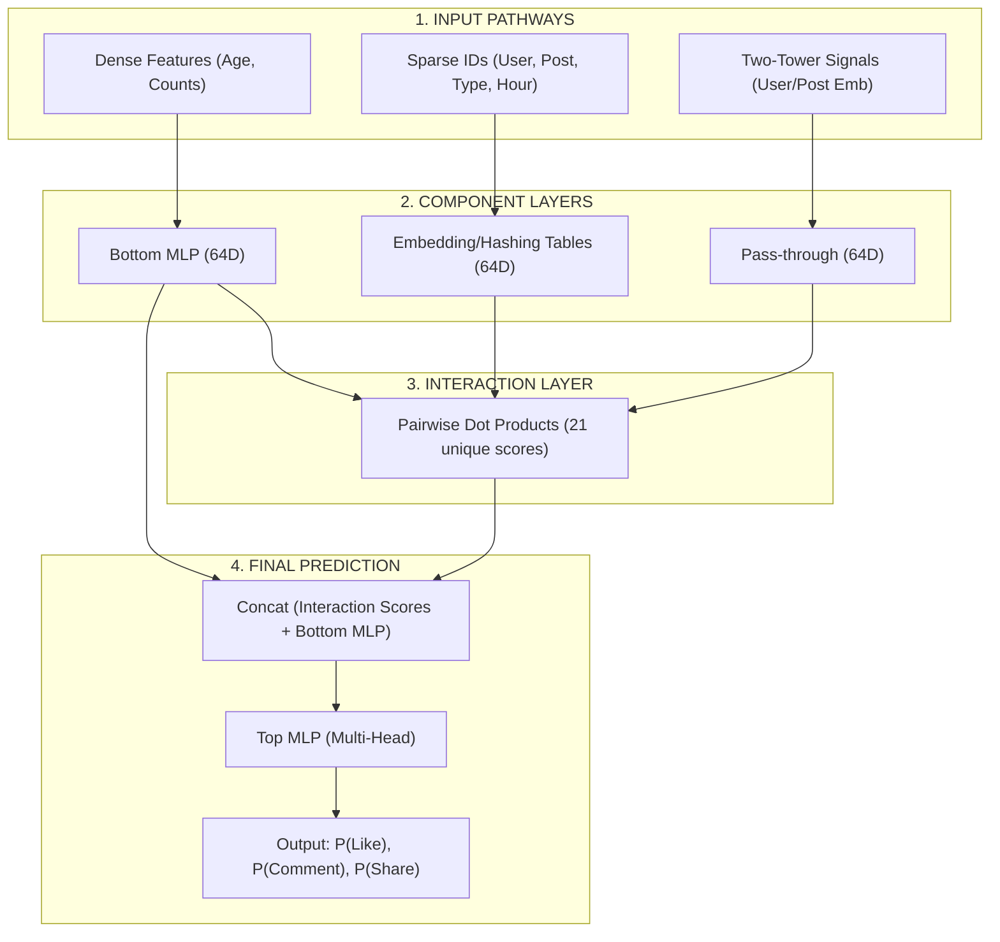

# Stage 3: Ranking (Deep Learning Recommendation Model)

**Goal:** Take the ~800 safe candidates from Stage 2 and use heavy ML to generate ultra-precise predicted interaction probabilities ($P(\text{Like}), P(\text{Comment}), P(\text{Share})$). Prioritize **Precision** over Recall.

## 1. Feature Disentanglement
Unlike the Two-Tower model which squashes every feature into one vector, a Ranker requires massive fidelity.
*   **The Problem:** Over-simplifying features. If `User_Age` is baked into the permanent `UserID` embedding, the system has a hard time reacting dynamically as the user grows older or generating specific cross-features (e.g., this user is 16 AND this specific post is violent).
*   **The Principle:** We disentangle the static **Identity** (Collaborative IDs) from the dynamic **Context** (Time, Age, Session details) at the input layer.

## 2. Integrated Two-Tower Signals
A unique strength of our architecture is the **Stage-1 Feedback Loop**. The 64D embeddings generated by the Two-Tower Retrieval model are not discarded; they are passed into the Ranker as additional "Geometric Features."

*   **Why?** The Two-Tower model has already learned a "global semantic map" of the community. Passing these vectors into the Ranker gives it a head-start on understanding the semantic relationship between a user and a post before it even looks at specific IDs.

***

## 3. Visual Architecture (The DLRM Flow)

***

## 4. DLRM Architecture (Meta’s Design)

## 3. DLRM Architecture (Meta’s Design)
Meta invented DLRM to handle these vastly different feature types efficiently through three disparate pathways.

### A. The Three Data Pathways
1.  **The Dense Path (Continuous):** Raw scalars (Age, interaction counts) are fed into a **"Bottom MLP"** to produce a 64D "Dense Latent Vector." This ensures low-dimensional scalars aren't mathematically overshadowed by high-dimensional embeddings.
2.  **The Sparse Path (Categorical):** High-cardinality IDs (UserID, PostID) are passed through **Hashing Embedding Tables**. Hashing bounds the RAM requirements while allowing the model to learn fine-grained preferences for specific identities.
3.  **The Tower Path (Stage-1):** The pre-calculated 64D vectors from the Two-Tower model are injected directly.

### B. The "Double Embedding" Strategy
The Ranker utilizes a hybrid approach, combining **Hashing-based ID Embeddings** with **Two-Tower Semantic Embeddings**:
- **Two-Tower:** Provides "Broad Semantic Context" (e.g., general interest in sports).
- **Hashing:** Provides "Specific Memorization" (e.g., specific affinity for a particular creator's ID).

## 4. The Dot-Product Interaction Layer (The "Magic" of DLRM)
Once all pathways have produced 64D vectors (7 vectors total in our current implementation), they enter the Interaction Layer.
*   **Geometric Correlation:** Instead of simple concatenation, DLRM explicitly calculates the **Pairwise Dot-Product** between every pair of features (e.g., $Tower\_User \cdot ID\_User$, $Dense\_Context \cdot ID\_Post$). 
*   **Interaction Scores:** With 7 input vectors, we generate **21 unique Interaction Scores**. 
*   **Benefit:** This architecture hands the final decision-making layer a pre-calculated map of correlations, drastically speeding up training convergence and improving ranking precision.

## 5. The Top MLP (Final Precision)
Final probability calculation for multiple heads ($P(\text{Like}), P(\text{Comment}), P(\text{Share})$) is done in the final **"Top MLP"**.

***

## 6. Expert Tips for the Heavy Ranker Interview

### A. Handling "Negative Transfer"
When you have multiple heads, a simple **Shared-Bottom** architecture (like ours) can suffer from "Negative Transfer," where learning to predict one task (Like) hurts the performance of another (Share).
- **The Senior Fix**: Suggest a **Multi-Gate Mixture of Experts (MMoE)** where each task has its own specialized "Experts" and a "Gate" to weigh them.

### B. The Calibration Requirement
Since the Heavy Ranker's outputs are often used in a **Weighted Sum** ($w_1 \cdot Like + w_2 \cdot Share$), the raw scores must be **Calibrated**. 
- **The Problem**: If you downsample negatives to save training costs, your model becomes over-optimistic.
- **The Fix**: Apply a transformation to the raw logit ($s$): $s' = s + \log(p / (1-p))$, where $p$ is the sampling rate. This ensures the output represents the true empirical probability.

### C. Feature Engineering Strategy
Focus on **"High-Cardinals"** (IDs) vs. **"Dense Encodings"** (Tower vectors).
- DLRM is designed to let these two worlds interact through the **Pairwise Dot-Product** layer. It's the most efficient way to capture "geometric correlations" between diverse feature types at scale.
